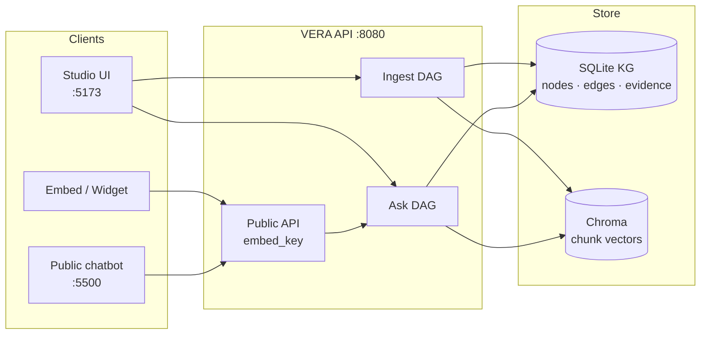
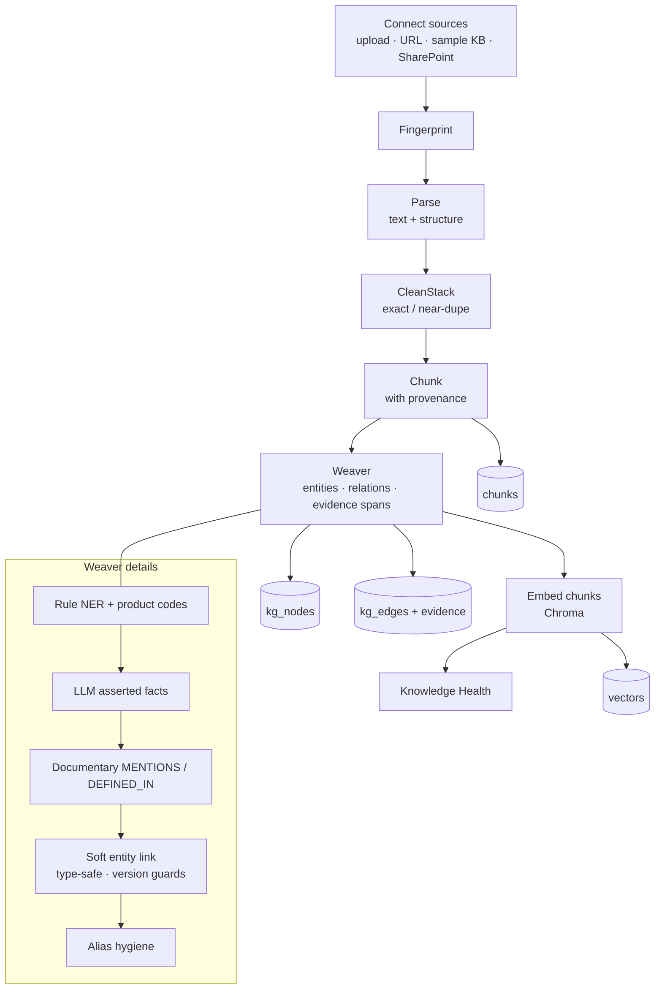
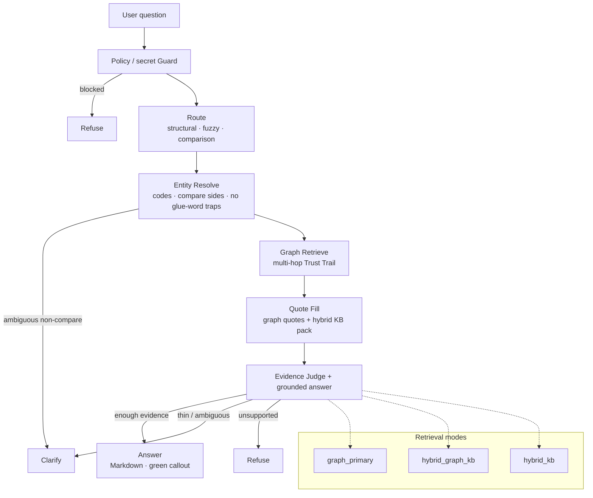
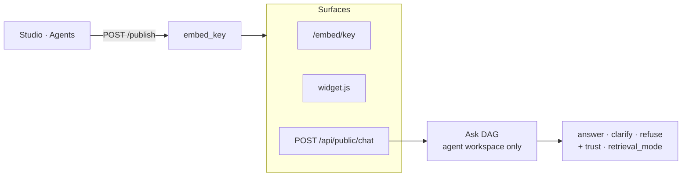

# VERA — Verified Evidence & Reliable Agents

**Graph-Primary Evidence Engine**

> VERA doesn’t search for answers first. It walks the knowledge, builds a Trust Trail, and proves every claim with evidence.

**Invariant:** `No evidence-bearing edge = no answer-bearing edge`

---

## What VERA is

VERA is a Studio + API stack for building **published knowledge agents**:

1. **Connect** documents (upload, URL, sample KB, optional SharePoint)
2. **Ingest** through CleanStack → Chunk → **Weaver** (domain-dynamic knowledge graph)
3. **Ask** with graph-primary retrieval, quote fill, and an evidence judge
4. **Publish** an embed key for public chat / site widgets
5. **Maps** — explore asserted structure, documentary links, and neighborhoods

Brand line: *Verified evidence. Reliable agents.*

---

## Quick start (Docker — recommended)

```powershell
cd C:\Parag-Personal\Kite
copy .env.example .env
# Set AZURE_OPENAI_API_KEY (and endpoint/deployment) in .env
docker compose up --build -d
```

| Surface | URL |
|---------|-----|
| Studio UI | http://localhost:5173 |
| API health | http://localhost:8080/api/health |
| API docs | http://localhost:8080/docs |

Open Studio → **Connect** → load sample KB or upload docs → **Ask** / **Maps** → **Agents** → **Publish**.

---

## Local (without Docker)

```powershell
# Backend
cd backend
python -m venv .venv
.\.venv\Scripts\activate
pip install -r requirements.txt
# repo-root .env must have Azure keys (or VERA_MOCK_LLM=true)
uvicorn app.main:app --reload --port 8080

# Frontend (second terminal)
cd frontend
npm install
npm run dev
```

Studio: http://localhost:5173

---

## Trust Pyramid

1. Knowledge Graph  
2. Trust Trail  
3. Evidence Quotes  
4. Cited Answer — or Clarify / Refuse  

---

## Architecture & flow diagrams

**Invariant:** no evidence-bearing edge ⇒ no answer-bearing edge.

| Layer | Location |
|-------|----------|
| API (FastAPI) | `backend/app/` |
| Studio (React) | `frontend/src/` |
| Graph SQL store | `backend/app/stores/sql.py` |
| Weaver | `backend/app/agents/ingest/weaver.py` |
| Ask agents | `backend/app/agents/ask/` |
| Public embed API | `backend/app/routers/public.py` |

Details: [docs/ARCHITECTURE.md](docs/ARCHITECTURE.md) · [docs/KNOWLEDGE-GRAPH.md](docs/KNOWLEDGE-GRAPH.md)

### System overview



### Ingest pipeline (build the graph)



One-liner: `Connect → Fingerprint → Parse → CleanStack → Chunk → Weaver → Embed`

### Ask pipeline (answer with proof)



One-liner: `Guard → Route → Resolve → Graph Retrieve → Quote Fill → Evidence Judge`

| Mode chip | Meaning |
|-----------|---------|
| `graph_primary` | Evidence-bound trail led the answer |
| `hybrid_graph_kb` | Trail + document gap-fill |
| `hybrid_kb` | Lexical / vector pack (overview / thin trail) |
| `clarify` / `refuse` | Integrity over fluency |

### Publish → public chat



Published agents are workspace-isolated. Public routes require `published` + origin checks (+ rate limit).

---

## Documentation

| Doc | Purpose |
|-----|---------|
| [docs/README.md](docs/README.md) | Doc index |
| [docs/KNOWLEDGE-GRAPH.md](docs/KNOWLEDGE-GRAPH.md) | Knowledge graph vs vector DB — benefits now & later |
| [docs/ARCHITECTURE.md](docs/ARCHITECTURE.md) | Pipelines, graph, retrieval modes |
| [docs/CONFIGURATION.md](docs/CONFIGURATION.md) | Env vars and defaults |
| [docs/PUBLIC-API.md](docs/PUBLIC-API.md) | Publish + public chat contract |
| [docs/PUBLISHING.md](docs/PUBLISHING.md) | Monetizable embed / widget guide |
| [docs/OPERATIONS.md](docs/OPERATIONS.md) | Docker, CORS, data volume, troubleshooting |
| [docs/VERA-MASTER-BUILD-PLAN.md](docs/VERA-MASTER-BUILD-PLAN.md) | Product invariant / design pointer |

Companion consumer app: `C:\Parag-Personal\Vera_PlayReady_Chatbot` (static chatbot over the public API).

---

## Demo questions (sample KB)

- Is MFA required for VPN?  
- Who owns the VPN platform?  
- Does Access Policy require MFA? *(clarify)*  
- What is the CEO's salary? *(refuse)*  
- Does Access Policy v2 supersede v1?  

Domain agents (e.g. PlayReady) get sample chips from the agent’s `domainProfile` — not hardcoded product lists in the engine.

---

## Project layout

```
Kite/
├── backend/           # FastAPI + agents + SQLite/Chroma
├── frontend/          # Studio UI (Ask, Maps, Agents, Connect)
├── docs/              # Architecture & ops docs
├── docker-compose.yml # vera-api (:8080) + vera-web (:5173)
├── .env.example
└── README.md
```

---

## Configuration

Copy `.env.example` → `.env`. Minimum for real answers:

- `AZURE_OPENAI_ENDPOINT`
- `AZURE_OPENAI_API_KEY`
- `AZURE_OPENAI_DEPLOYMENT`

Without keys, set `VERA_MOCK_LLM=true` for a mock path.

Full reference: [docs/CONFIGURATION.md](docs/CONFIGURATION.md)

---

## License / status

Internal / hackathon workspace. Treat API keys and embed keys as secrets; never commit a filled `.env`.
